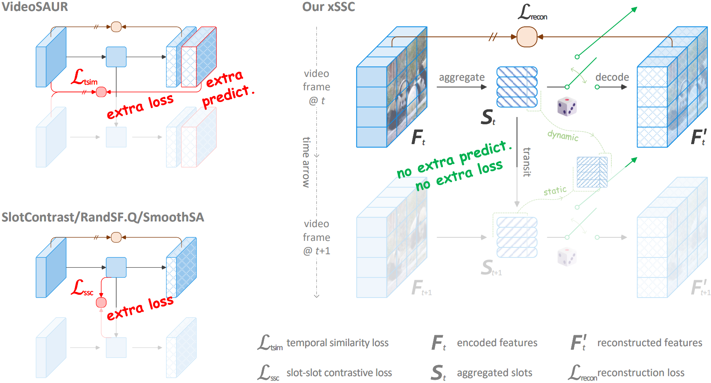
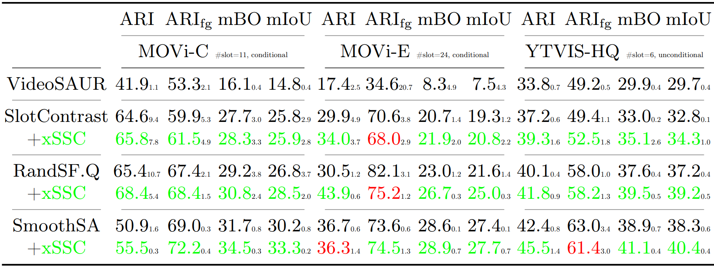
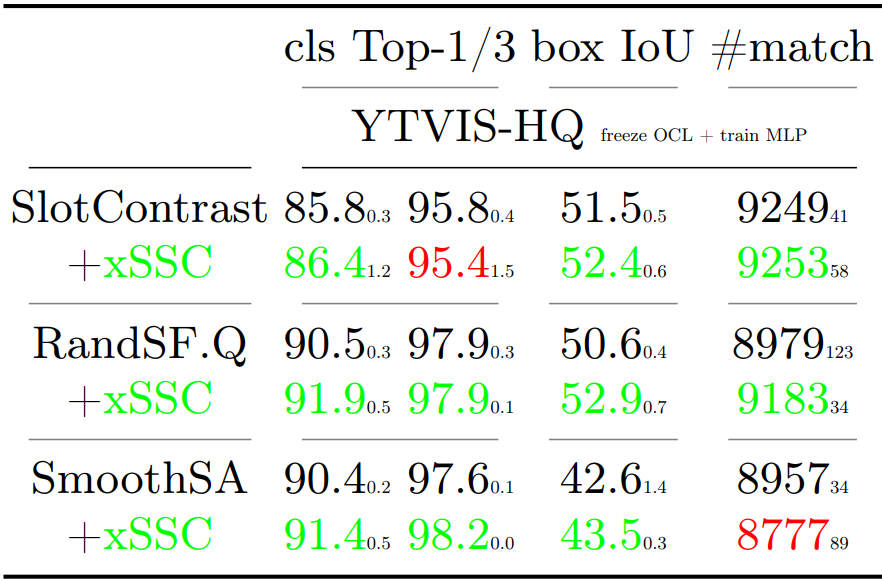

# `xSSC` Internalizing Temporal Consistency in Video Object-Centric Learning without Explicit Regularization


[](https://arxiv.org/abs/2605.31508)<!-- [](https://www.python.org) -->
[](LICENSE)
[](https://github.com/Genera1Z/xSSC#-model-checkpoints--training-logs)
[](https://github.com/Genera1Z/xSSC#-model-checkpoints--training-logs)


> Video Object-Centric Learning (OCL) aims to represent objects as \textit{slot} vectors and maintain their consistency across frames. Slot-Slot Contrastive (SSC) loss has become the cornerstone for state-of-the-art (SOTA) video OCL methods. While highly effective, SSC relies on one-to-one object correspondence across frames and introduces an extra loss. Following Occam's Razor, we propose a paradigm shift: temporal consistency is better enforced as an implicit model design rather than an explicit loss.
To elegantly exclude SSC (\textbf{xSSC}), we introduce two quasi-zero-overhead synergistic mechanisms:
(\textit{i}) Chrono-Channel Decomposition (CCD) structurally disentangles slot representations along the channel dimension into \textit{static} and \textit{dynamic} sub-spaces, serving as an empirically unified information bottleneck;
(\textit{ii}) Cross-Temporal Reconstruction (CTR) stochastically reconstructs target features of either the current or previous time step by fusing current slots' static channels and target slots' dynamic channels, using a single standard OCL decoder with minor training adaptation.
Thereby, the slot sets inherently learn temporal consistency by minimizing the standard reconstruction error alone.
Extensive experiments show that integrating xSSC into leading baselines not only improves training efficiency but also establishes new SOTAs on video object discovery and recognition tasks. Furthermore, our PCA and gradient analyses confirm that objects' time-invariant semantics and time-variant kinematics are encoded into the proposed sub-spaces.


<!-- ## 🎉 Accepted to ECCV 2026 as a Poster -->

Official source code, model checkpoints and training logs for paper "**Internalizing Temporal Consistency in Video Object-Centric Learning without Explicit Regularization**".

**Our model achitecture**:




## 🏆 Performance

**Object discovery accuracy**: (Input resolution is **256×256** (224×224); **DINO2 ViT-S/14** is used for encoding)



**Update**: object discovery accuracy on YTVIS-2022:

|   @ YTVIS-2022  |    ARI   |   ARIfg  |    mBO   |   mIoU   |
|:---------------:|:--------:|:--------:|:--------:|:--------:|
| RandSF.Q | 37.9±1.3 | 51.8±1.2 | 32.2±1.8 | 31.5±1.8 |
|   + xSSC | 39.5±0.2 | 56.6±1.9 | 34.7±0.2 | 34.0±0.3 |
| SmoothSA | 42.0±0.6 | 59.0±2.1 | 36.0±0.5 | 34.9±0.6 |
|   + xSSC | 42.6±1.1 | 58.3±0.5 | 35.6±0.6 | 34.5±0.7 |

**Object recognition accuracy**:




## 🌟 Highlights

⭐⭐⭐ ***Please check GitHub repo [VQ-VFM-OCL](https://github.com/Genera1Z/VQ-VFM-OCL).*** ⭐⭐⭐


## 🧭 Repo Stucture

[Source code](https://github.com/Genera1Z/xSSC).
```shell
- config-randsfq/       # *** configs for RandSF.Q + xSSC ***
- config-smoothsa/      # *** configs for RandSF.Q + xSSC ***
- object_centric_bench/
  - datum/              # dataset loading and preprocessing
  - model/              # model building
    - ...
    - randsfq.py        # for baseline RandSF.Q model building
    - randsfq2.py       # *** our RandSF.Q + xSSC ***
    - smoothsa.py       # for baseline SmoothSA model building
    - smoothsa2.py      # *** our SmoothSA + xSSC ***
    - ...
  - learn/              # metrics, optimizers and callbacks
- train.py
- eval.py
- requirements.txt
```

[Releases](https://github.com/Genera1Z/xSSC/releases).
```shell
- archive-rsfq2/        # *** our RandSF.Q + xSSC models and logs ***
- archive-ssav2/        # *** our SmoothSA + xSSC models and logs ***
```


## 🚀 Converted Datasets

Datasets MOVi-C, MOVi-E and YTVIS-HQ / YTVIS-2022 are converted into LMDB format and can be used off-the-shelf.
For details, please check [RandSF.Q](https://github.com/Genera1Z/RandSF.Q#-converted-datasets) or [SmoothSA](https://github.com/Genera1Z/SmoothSA#-converted-datasets)


## 🧠 Model Checkpoints & Training Logs

**The checkpoints and training logs (@ random seeds 42, 43 and 44) for all models** are available as [releases](https://github.com/Genera1Z/xSSC/releases). All backbones are unified as DINO2-S/14.
- [archive-rsfq2](https://github.com/Genera1Z/xSSC/releases/tag/archive-rsfq2): Our `RandSF.Q + xSSC` trained on datasets MOVi-C/E and YTVIS-HQ / YTVIS-2022, both object discovery and object recognition.
- [archive-ssav2](https://github.com/Genera1Z/xSSC/releases/tag/archive-ssav2): Our `SmoothSA + xSSC` trained on datasets MOVi-C/E and YTVIS-HQ / YTVIS-2022, both object discovery and object recognition.
- For other video OCL baselines, **VideoSAUR**, **SlotContrast**, **RandSF.Q** and **SmoothSA**, please check repo [RandSF.Q](https://github.com/Genera1Z/RandSF.Q#-model-checkpoints--training-logs) and [SmoothSA](https://github.com/Genera1Z/SmoothSA#-model-checkpoints--training-logs).


## 🔥 How to Use

Please check repo [RandSF.Q](https://github.com/Genera1Z/RandSF.Q#-how-to-use) or [SmoothSA](https://github.com/Genera1Z/SmoothSA#-how-to-use).


## 🤗 Contact & Support

If you have any issues on this repo or cool ideas on OCL, please do not hesitate to contact me!
- page: https://genera1z.github.io
- email: rongzhen.zhao@aalto.fi, zhaorongzhenagi@gmail.com

If you are applying OCL (not limited to this repo) to tasks like **visual question answering**, **visual prediction/reasoning**, **world modeling** and **reinforcement learning**, let us collaborate!


## ⚗️ Further Research

My further research works on OCL can be found in [my repos](https://github.com/Genera1Z?tab=repositories) or [my academic page](https://genera1z.github.io).


## 📚 Citation

If you find this repo useful, please cite our work.
```
@article{zhao2026xssc,
  title={{Internalizing Temporal Consistency in Video Object-Centric Learning without Explicit Regularization}},
  author={Zhao, Rongzhen and Li, Zhiyuan and Kannala, Juho and Pajarinen, Joni},
  journal={arXiv:2605.31508},
  year={2026}
}
```
